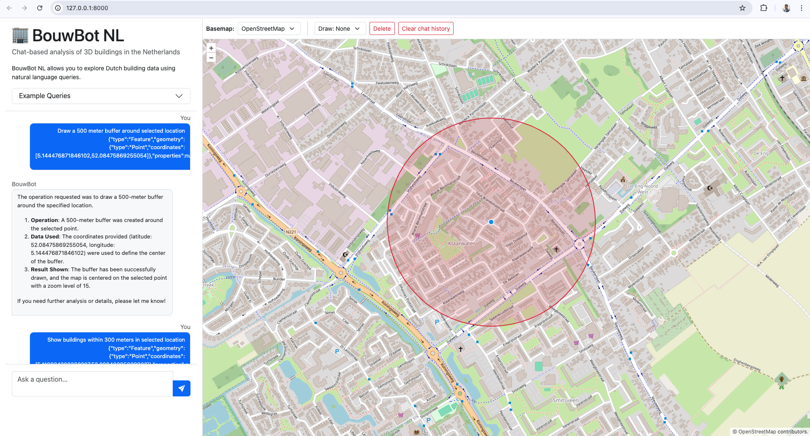

# 🏢 BouwBot NL 

**BouwBot NL** is an open-source, chat-based geospatial analysis tool
for exploring 3D building data in the Netherlands.
(“Bouw” = building in Dutch)

BouwBot NL is a conversational geospatial analysis tool that allows users to explore and analyze 3D building data in the Netherlands using natural language. The system translates chat-based queries into vector-based spatial operations on building footprints and height attributes.

The application will be designed to make Dutch 3D building datasets accessible to non-GIS users, while still producing accurate, reproducible spatial analysis results.
BouwBot NL supports a controlled set of interpretable queries, mapped to explicit spatial operations.

Tool utilized 3DBAG open source building data set and ChatGPT API 

Key characteristics:

- Chat-driven analysis: users ask questions in natural language
- Tool-based execution: the assistant calls predefined tools (Python functions) for spatial analysis
- Reproducible outputs: results are returned as map layers and exported GeoJSON files
- Safety by design: unsupported topics are refused (no hallucinated results)

## 1) Example queries:
**For this demo, analysis is currently limited to Utrecht to keep data size, performance, and computational complexity manageable.**

- Show Utrecht Maliebaan on the map
- Draw a 500 meter buffer around selected location
- Show buildings within 300 meters in selected location
- Show buildings higher than 5 meters within 300 meters in selected location
- What is the minimum, average, and maximum building height within 500 meters of this point?
- Give height statistics for buildings within 300 meters of this point
- Which is the tallest building within 300 meters of this point?
- What is the average building footprint within 400 meters of this point?
- What is the total building volume within 500 meters of this point?
> ❌ Questions outside these categories (prices, predictions, energy use, zoning laws, etc.) are **not supported** in this demo.


[](static/demo.mp4)


---

## **Data source:**  3D BAG / 3DBAG (https://3dbag.nl/en/download  )
The 3DBAG is an up-to-date data set containing 3D building models of the Netherlands. The 3DBAG is open data. It contains 3D models at multiple levels of detail, which are generated by combining two open data sets: the building data from the BAG and the height data from the AHN. The 3DBAG is updated regularly in order to remain up-to-date with the latest openly available building stock and elevation information.

> This demo currently uses **Utrecht only** because nationwide data is large and more complex to run locally. 


---

## 3) Data Download
We downlaoded full netherlands building dataset from  3D BAG / 3DBAG data: https://3dbag.nl/en/download
Geopackage 3dbag_nl.gpkg.zip 19 GB (111 GB uncompressed)
then clipped this only for Utrecht boundary using gdal
use 3dbag_data_processing.ipynb to clip and preproces this data (Gdal need to be installed in PC) or directly download clipeed data from
https://universiteittwente-my.sharepoint.com/:u:/g/personal/a_chaudhary_student_utwente_nl/IQDHtQgJgGP0TL5GC5U3clYiAcVRjKkvsy1vtP7zpr0LpNE?e=ykg9lp


then used this clipped data in tool
place it here
/static/data/utrecht_pand_clip.gpkg

## 4) Tool Setup
```
1. Create venv & install
python -m venv venv
source venv/bin/activate          # mac/linux
# venv\Scripts\activate           # windows

pip install -r requirements.txt


2. Create a .env file in the project root:
OPENAI_API_KEY=your_openai_key
FLASK_SECRET_KEY=ververysecretkeyxdxdxdx

3. Run the app
python app.py


Open: http://127.0.0.1:8000


```

## 5) How it works (high level)

1. User types a question or draws a point on the map
2. Frontend sends:
    - chat message
    - optional drawn geometry (GeoJSON)
3. Flask backend:
    - maintains chat + map state in session
    - calls OpenAI with strictly defined tools
4. Tools run GeoPandas analysis on Utrecht data
5. Backend returns:
    - assistant text response
    - map instructions (markers, buffers, GeoJSON URLs)
6. Frontend renders results on the map


## testing
Pytest test suite for your geospatial tool functions
python -m pytest   